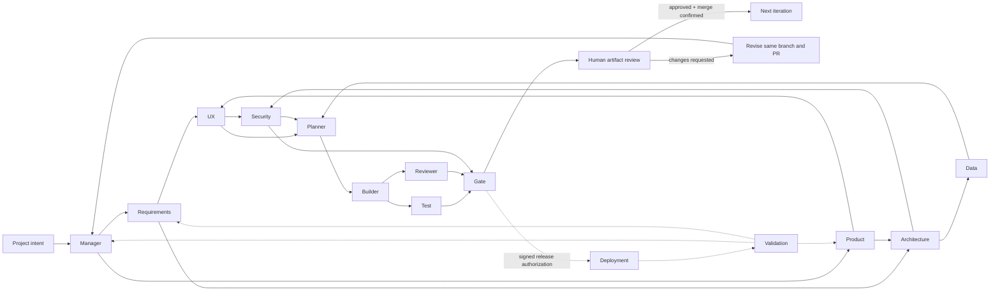

# Artifact-driven delivery graph

Each project owns a long-running Project Organism Workflow at `project/{projectId}`. All 14 roles run as durable actors at `project/{projectId}/agent/{role}`, with their own mailbox, state, query surface, history, and Continue-As-New policy. The project workflow advances bounded iterations and pauses after Gate until a human reviews the iteration artifacts.



This is the mandatory iteration topology, not a relay or a claim that every later round reruns every role. The first execution round schedules all mandatory roles: Requirements and Product form the first parallel branch; UX and Architecture can then work independently from their shared inputs; Data can begin as soon as Architecture finishes while Security joins Architecture with the UX journey; and Test and Reviewer independently inspect Builder output. Gate is blocked until the independent test, review, and security evidence exists. The scheduler starts newly unblocked children immediately rather than waiting for an artificial stage-wide barrier.

Later rounds use reactive activation without changing this topology. A role marked `not_ready` in the review proposal, or named by targeted human feedback, becomes a seed; the project workflow adds every transitive downstream role affected by that work and always adds Gate. Broad direction, artifact-wide feedback, or no usable seed falls back to the full mandatory graph. An upstream role is not reactivated merely to recreate the original wave when only its downstream evidence path is affected.

Hard dependencies, supervision, and permitted communication are different relationships. A hard dependency prevents an order from starting until its upstream artifact exists. Supervision gives a role responsibility for guidance and escalation without unnecessarily serializing the work. Permitted communication includes backward remediation and outcome feedback, so it is broader than the current execution path. Manager supervises the shaping roles, Product guides UX, Architecture guides Data, Security, and Builder, and Planner coordinates implementation and test work.

Deployment and Validation are registered and visible for every project. Their organizational state is `monitoring` while the default iteration scheduler withholds external work. A Gate artifact and ordinary iteration approval are not deployment authorization. A future release adapter must present a signed authorization for one immutable artifact before those roles may execute external rollout or outcome-collection activities.

## Artifact contract

Every generated artifact has a project and iteration identity, type, human-readable name, monotonically increasing version, producing role, model identity, review state, Forgejo path and URL, creation time, and review time. Events provide the chronological audit view while artifacts provide the versioned review package.

The initial project transaction creates:

- iteration 1;
- a `project-intent` artifact;
- a `Project studio opened` event.

The project workflow creates a private Forgejo repository and iteration issue before agent work starts. It calculates every dependency-ready wave and submits bounded, authority-scoped commands to all ready role actors together. Each actor receives explicit repository coordinates, the newest relevant artifacts from prior iterations, its own prior output, and the current dependency handoffs. Builder also receives earlier `source-file:*` outputs so revision work remains incremental. Generated source cannot write reserved CI/workflow trees or root credential/environment files. Handoffs are recorded in project history and the Forgejo issue. Candidate-producing outputs are committed to the shared `iteration-N-agents` branch; Test, Reviewer, and Gate assurance outputs are ledger-only and carry the immutable candidate `sourceRevision`. A Gate result opens a pull request only when its structured decision is `pass`, its missing-evidence list is empty, and every declared upstream evidence artifact is present for that frozen revision. Manager then records a separate ledger-derived rationale and recommendation before human review opens. Otherwise the iteration blocks and reactivates the affected downstream path after remediation; neither Manager nor the UI can silently bypass Gate.

Human question answers, agent comments, artifact feedback, per-agent review notes, and overall direction are persisted and included in subsequent or retried orders. A role that raises a consequential question is not handed off as complete, and its downstream graph edges stay blocked until every correlated question is durably answered. While the workflow is awaiting approval, human messages are flushed immediately instead of waiting for the final review decision. A change request keeps the same iteration, branch, issue, and pull request open for another agent pass. Targeted agent feedback reactivates that role and its downstream evidence path; overall direction or artifact-wide feedback triggers the full mandatory graph. Approval first moves the durable iteration to `approved` while its artifacts remain review candidates; only a confirmed Forgejo merge moves the iteration to `completed` and its artifacts to `approved`. A merge conflict blocks advancement and never closes the issue.

Every review window has a deterministic checkpoint containing the iteration ID, pull-request number, and review token. The preferred signal envelope is `{ iterationId, reviewToken, idempotencyKey, review }`; stale tokens, wrong iterations, early submissions, and duplicate idempotency keys are ignored. The same operation key is persisted with the review and its lifecycle/event records, so an Activity retry reuses the committed review instead of inserting another one. A compatibility path still accepts legacy bare review signals only inside an active window and fingerprints them to prevent exact replay across later iterations.

The permission-gated Forgejo lifecycle adapter exposes issues linked to pull requests, labels, repository projects, releases, generic review packages, and wiki pages. Every step reports `completed`, `skipped`, or `failed`. Optional publication failures cannot invalidate a confirmed merge, while the merge itself is never inferred from an HTTP conflict. Repository lifecycle records preserve these outcomes for audit and UI use.

UX output can include a structured user journey. The model worker converts that structure into an escaped, script-free SVG rather than trusting model-authored markup. Builder must also supply the versioned preview runtime contract: a root Dockerfile, one exposed port at `8080`, and an active `GET /health` check. Before Test runs, the validation worker asks the local preview manager to resolve the iteration branch to an immutable Forgejo revision, build it, start it in the isolated preview network, and prove health. A deployment failure creates a visible blocker and the workflow waits for a retry; Test, Gate, and the human approval checkpoint cannot bypass it.

Test receives the deployment's internal URL and immutable revision explicitly, never a project-global fallback URL. Reviewer and Gate receive the same preview contract and revision. Browser requests are constrained to that preview origin. Test's WebM is stored on a separate evidence branch, while the Test, Reviewer, and Gate artifacts themselves are stored only in the ledger; none of that assurance evidence can mutate the candidate branch it proves. After Gate, Orchestra resolves the branch again, rejects any revision drift, and creates a review checkpoint bound to the frozen candidate. Approval requires the human to attest that they tried that exact deployed revision, and Forgejo verifies the pull-request head still matches before merging.

## Local model execution

Every role actor runs on `orchestra-agent-<role>` and owns a deterministic interpreter for its bounded order. The actor asks purpose-specific model child workflows on `orchestra-model-<role>` to plan, analyze, assess progress, repair an invalid plan, review output, or assess completion. Structured model results become recorded workflow data; the actor alone validates capabilities and authority, executes Activities, accounts for budgets, and applies deterministic completion checks. Role and model-brain queues may be polled together or assigned to independent processes without changing workflow histories. See [dynamic agent execution](DYNAMIC_AGENT_EXECUTION.md) for the complete role-local loop.

`apps/model-worker` is the only application allowed to talk to an inference provider. Set the global `MODEL_PROVIDER=ollama|openrouter` and optionally override a role with `MODEL_PROVIDER_<ROLE>`. A credential-free routing worker binds the selected provider and model into Temporal history before inference begins.

With Ollama, every final planning, analysis, assessment, repair, review, or completion request enters a single long-lived FIFO inference-lane workflow on `orchestra-ollama-inference`. That workflow awaits one HTTP Activity before dequeuing another; the inference worker also keeps concurrency at 1. Scaling agent or brain workers therefore does not create overlapping local GPU calls.

With OpenRouter, brain workflows call a separate hosted-provider queue and its worker raises concurrency (default 8, maximum 64), so many roles can reason in parallel. Each final provider request remains visible as its own inference child workflow. Only that worker receives the API key. It requires `OPENROUTER_ALLOW_REMOTE_DATA=true`, supports a model allowlist, caps output/response sizes, and records provider usage with the run and resulting artifacts. See [worker topology](WORKER_TOPOLOGY.md) for queue groups, isolated worker modes, and history migration rules.

Role models are selected from provider-specific env maps (`OLLAMA_MODEL_*` or `OPENROUTER_MODEL_*`), with built-in defaults for each role. Example:

```text
MODEL_PROVIDER=openrouter
OPENROUTER_API_KEY=sk-or-...
OPENROUTER_ALLOW_REMOTE_DATA=true
OPENROUTER_MODEL_BUILDER=qwen/qwen3-coder
OPENROUTER_MODEL_REVIEWER=anthropic/claude-sonnet-4.6
```

Ollama models are not pulled automatically. Pull the configured local models before starting delivery when `MODEL_PROVIDER=ollama`.

## Execution boundary

The loop now produces and commits planning, requirements, visual journey, architecture, security, source-file, test, review, gate, and conditional recording artifacts. Forgejo issues, branches, commits, comments, pull requests, approved merges, lifecycle labels, repository projects, releases, generic packages, and wiki pages are explicit permission-bounded system-of-record operations. Local Docker preview execution is isolated from the control plane and bound to an exact source revision; it is not production rollout authorization. Credential brokering and production deployment remain later permission-bound layers.
