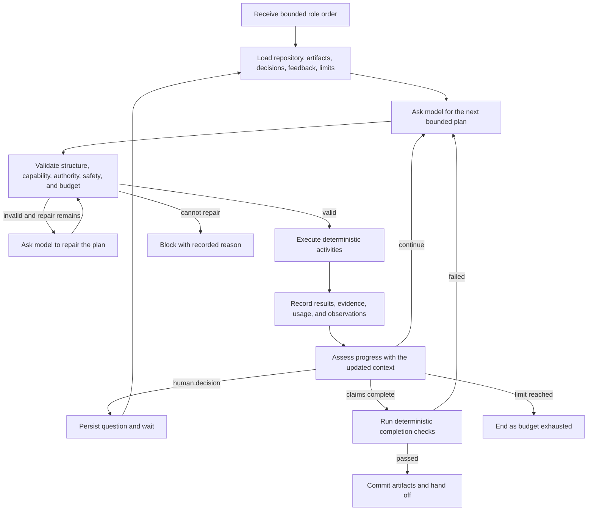

# Dynamic agent execution

Orchestra uses a deterministic, replay-safe workflow to interpret bounded action plans proposed by a model. The model decides what should happen next; the workflow decides what is permitted, executes only registered capabilities, and records what actually happened.

This is a role-local execution model. It does not replace the project delivery graph in `packages/contracts/src/index.ts`:

- the project workflow still decides which role is dependency-ready;
- Requirements and Product, UX and Architecture, and Test and Reviewer can still become ready in parallel;
- Planner and Gate still enforce their deterministic joins;
- Deployment and Validation still require explicit release authority;
- each ready role receives one bounded goal and runs its own dynamic execution loop inside that boundary.

The outer topology therefore stays stable and reviewable while activation can react to durable evidence. The initial round executes the full mandatory iteration graph. On later rounds, the project workflow—not a role model—may seed roles from `not_ready` ledger positions or targeted human feedback, expand them through the transitive downstream path, and force Gate to re-evaluate. Broad direction or no usable seed falls back to all mandatory roles. Within whichever roles are activated, each actor can adapt only its own bounded work to the evidence it discovers.

## Current implementation scope

The shared contracts, validator, dependency scheduler, budgets, terminal states, and replay-safe model topology are general runtime foundations. The first executable adapter is intentionally narrower: role artifact production currently registers `model.generate_artifact@1.0`, `model.review_artifact@1.0`, and `model.revise_artifact@1.0`. The model chooses the next bounded action or completion state; the workflow does not blindly run all three.

Repository read/search/patch/test, artifact-store, Forgejo, preview, and approval capabilities are the next registry adapters. They are not exposed to model-authored plans yet. Until those adapters exist, repository mutation and delivery gates continue through the existing deterministic outer workflow.

## Control loop



The durable state machine is:

```text
RECEIVE_GOAL
→ LOAD_CONTEXT
→ PLAN
→ VALIDATE_PLAN
→ EXECUTE_ACTIONS
→ COLLECT_OBSERVATIONS
→ ASSESS_PROGRESS
  ↳ REPLAN → PLAN
  ↳ WAIT_FOR_HUMAN
  ↳ VERIFY → COMMIT → HANDOFF
  ↳ BLOCK
  ↳ EXHAUST_BUDGET
```

State transitions are workflow-owned and deterministic. A model response is data consumed by the interpreter, never a workflow definition or an instruction to bypass the interpreter.

## Goal and plan contract

A role order supplies the goal, authority, scope, acceptance criteria, evidence obligations, repository coordinates and reviewed revision, relevant artifacts, durable human decisions and feedback, available capabilities, and token, cost, time, iteration, and mutation limits.

The model proposes only the next bounded batch. A typical response contains an assessment, uniquely identified actions, optional dependencies within the batch, reasons, and a completion check:

```json
{
    "protocolVersion": "1",
    "goalAssessment": "No candidate exists yet.",
    "contextVersion": 3,
    "acknowledgedDecisionIds": ["decision:export.format"],
    "actions": [
      {
      "id": "generate-candidate",
      "activity": "model.generate_artifact",
      "activityVersion": "1.0",
      "arguments": {},
      "dependsOn": [],
      "reason": "Produce a bounded candidate before independent review."
      }
  ],
  "completionCheck": {
    "type": "continue",
    "reason": "Implementation evidence has not been collected yet."
  }
}
```

An action ID is unique within the run and becomes part of its durable idempotency identity. Activity lookup binds the requested stable name to the exact registered version recorded for the run. Unknown fields and partially parsed output are not silently accepted.

Plans should normally cover only the next useful observations or side effects. Long speculative plans become stale quickly and consume the action, context, and cost budgets without incorporating new evidence.

## Capability registry

The model can select only activities in the receiving role's capability registry. Every entry must declare:

- stable name and version;
- plain-language description;
- strict input and output schemas;
- required authority and allowed scope;
- read-only or mutating classification;
- idempotency behavior and operation-key rules;
- timeout and bounded retry policy;
- data-sensitivity and model-disclosure rules;
- maximum result size and truncation or artifact-storage behavior;
- whether human approval is required.

Schema metadata alone is not treated as executable validation. Registry construction rejects an entry that does not provide both an argument validator and a result validator. The interpreter runs the argument validator before scheduling an Activity and validates the returned value before mutating workflow state, recording usage, or exposing an observation to the next model call. Undeclared input or output fields therefore fail closed.

As additional adapters are registered, repository, artifact, human, Forgejo, preview, and validation operations must remain Activities or child workflows behind this registry. Workflow code does not perform network, filesystem, database, provider, or Git side effects directly.

Capabilities are narrower than responsibilities. A Builder may be responsible for implementation without automatically receiving credential access, production deployment, protected-path writes, or approval authority. A plan cannot expand the grant attached to its order.

## Plan validation and repair

Before any action is scheduled, the interpreter validates the complete batch. It rejects a plan that:

- names an unavailable capability or incompatible version;
- fails an activity's argument schema;
- exceeds the role's authority, repository scope, environment scope, or mutation allowance;
- uses an unsafe, absolute, traversing, reserved, or otherwise prohibited path;
- contains duplicate action IDs, unknown dependencies, or a dependency cycle;
- exceeds the maximum actions, files, result size, parallelism, model calls, or remaining budget;
- schedules conflicting mutations concurrently;
- repeats completed work without new evidence and a recorded justification;
- ignores a durable human decision or artifact feedback;
- bypasses a required review, approval, Gate, preview, or immutable-revision check;
- declares completion without the evidence required by the order.

No action from a rejected batch executes. The validation findings are supplied to a bounded plan-repair call. If the repair limit is reached, the run terminates as `blocked` with the validation evidence instead of retrying indefinitely.

## Deterministic execution

Valid actions execute in dependency order. Independent read-only actions may run concurrently up to the order's limit. Mutating actions are serialized unless the registry and validator can prove that they target independent resources. Stable ordering resolves ties so the same recorded plan always schedules the same commands.

Each activity receives a durable operation key derived from the run and action identity. Retries reuse that key. Activities must either be naturally idempotent or persist the operation key with their result so an Activity retry cannot duplicate a commit, question, artifact, issue, or other mutation.

Artifact recovery is bound to the exact persistence envelope that created the snapshot. The stored manifest covers the draft plus its iteration, artifact type, producing role, storage mode, and source revision. Recovery accepts only a matching artifact that is still `draft` or `ready_for_review`; a rejected or superseded artifact cannot be revived by retry. This prevents evidence produced for one immutable revision or persistence target from being reused for another.

A technical retry of the same candidate keeps the same operation key and safely reuses the recorded result. A deterministic Builder preflight rejection is different: the workflow marks that candidate's artifacts as superseded, clears its interpreter checkpoint, increments a revision-scoped artifact operation key, and asks the model to produce a fresh candidate. Superseded attachments remain auditable but are excluded from later reactive context. Model-level revisions inside one interpreter run remain tracked separately from these outer corrective artifact revisions.

An action failure is recorded as an observation. Independent actions may still finish, but dependent actions do not run without their prerequisites. Retry policy belongs to the capability; decisions to remediate, replan, ask a human, or stop belong to the interpreter and the next bounded model assessment.

## Human decisions

When a decision exceeds the role's authority, the model can return a structured `human_input_required` completion check with a stable decision key, understandable options, and explicit custom-answer or agent-decides permissions. The interpreter maps that request to the terminal execution state `waiting_for_human`, persists the question, and schedules no further work for that order.

The accepted answer becomes durable project context. It is included in every later planning, repair, authoring, review, and completion call. On `waiting_for_human`, the current adapter records a checkpoint containing the candidate, observations, action identities, usage, limits, and elapsed budget. After the answer is persisted, the same logical execution resumes from that checkpoint with a newer context version and the decision identity in its required acknowledgements; it does not regenerate an already-recorded candidate or reset the order budget. A Temporal patch keeps older histories on their original restart behavior. Duplicate question Activities reuse their operation key. Choosing “let the agent decide” delegates only that recorded decision within the existing scope; it does not broaden repository, spending, credential, or deployment authority.

New project histories reconstruct guidance in stable-key pages of 50 records, scope artifact feedback to the producing role, and retain legacy one-shot loading for replay compatibility. Paging bounds each Activity response, but a full reload currently still enumerates the lifetime guidance ledger; durable guidance compaction or database-native effective-context pagination remains a scaling follow-up.

## Budgets and loop termination

Every order has finite limits. Depending on the role and risk, these include:

- actions per planning batch and files per repository action;
- concurrent read-only actions and serialized mutations;
- planning rounds and consecutive plan-repair attempts;
- model calls, prompt tokens, completion tokens, and reported provider cost;
- wall-clock time and Activity timeouts;
- no-progress rounds, mutation scope, and maximum result sizes.

Usage is accumulated from recorded model and Activity results. Before scheduling more work, the interpreter verifies that the next bounded operation is permitted by the remaining limits. Repeated-action signatures and consecutive rounds without new artifacts, decisions, evidence, or materially different observations trigger no-progress protection.

The project coordinator does not automatically spin on a rejected corrective artifact. A deterministic parent preflight failure records the blocked state and waits for a durable human retry before starting the next revision-scoped attempt. Each interpreter attempt retains its own hard budget; a cumulative ceiling across separately human-authorized corrective attempts is not currently configured.

For new workflow histories, every inference call also receives a provider-side envelope containing the remaining total-token allowance, remaining cost allowance, and one absolute execution deadline. Queue waits and child-workflow lifetimes honor that deadline. Local inference receives a bounded generation length; hosted inference receives a bounded output length and price ceiling, with provider fallback and hidden HTTP retries disabled for the budgeted call. Missing, invalid, late, or over-budget provider usage fails closed instead of being accepted and merely reported afterward.

Every role order ends in exactly one state:

| State | Meaning |
| --- | --- |
| `completed` | Deterministic completion checks passed and the handoff was committed. |
| `waiting_for_human` | A specific human-owned decision is durably recorded and required to resume. |
| `blocked` | A technical, policy, authority, validation, or approval failure prevents progress. |
| `budget_exhausted` | A configured token, cost, time, action, repair, or round limit was reached. |

`waiting_for_human` is the workflow state corresponding to a model response of `human_input_required`. It is distinct from a technical blocker and from running out of budget.

## Completion authority

The model may recommend completion, but it cannot complete an order by assertion. The current artifact adapter verifies that a candidate exists, that an independent review passed for that exact candidate version, that deterministic artifact parsing succeeds, and that no required human acknowledgement remains unresolved. Required evidence identities are resolved against workflow-supplied artifact IDs, types and repository URLs, preview and source revisions, plus the order's deterministic output artifact identity—not merely strings echoed by the model. Model-selected action IDs and provider request IDs remain audit data and cannot satisfy evidence obligations. A claimed evidence reference that is absent from the trusted set becomes a failed completion observation and forces another bounded plan or a terminal stop.

For Test, Reviewer, and Gate orders, the immutable preview is mandatory and their resulting artifacts are persisted to the ledger with its `sourceRevision`, never staged onto the candidate branch. The outer project workflow continues to enforce Gate readiness, candidate-revision freezing, human review, and merge rules.

Future capability adapters can add measurable checks such as:

- every required artifact exists and satisfies its schema;
- required tests and independent reviews passed;
- evidence semantics, currency, and attribution satisfy capability-specific policy beyond identity resolution;
- all mutations stayed inside the order's authority and reviewed repository scope;
- no unresolved human question or required approval remains;
- the repository head and preview evidence still match the reviewed immutable revision;
- Gate and release authorization rules still hold.

Failed checks become observations for another planning round if budget remains. Only successful checks permit artifact persistence, handoff, and a `completed` result. The existing project workflow remains responsible for downstream dependency readiness, evidence-driven later-round reactivation, human iteration review, guarded pull-request merge, and any separately authorized release. Gate's deterministic rationale and Manager's ledger-derived cutoff rationale remain separate fields in the review proposal; a model completion claim supplies neither one.

## Replay and history evolution

Planning, plan repair, artifact authoring, independent review, and revision use model-interaction child workflows. Each final provider request remains visible as its own inference workflow. Temporal records the child result, so replay consumes that recorded response and never calls the model again to reconstruct a plan. The protocol also reserves progress- and completion-assessment purposes for later adapters.

Activity results, timers, signals, child results, and selected capability versions likewise come from workflow history during replay. Workflow code must not read mutable environment configuration, current repository state, wall-clock APIs, or provider state to recreate earlier choices.

Persistent role actors do not Continue-As-New while an order or human question is active. Queue or interpreter changes use Temporal patch markers or a new workflow type. Legacy generate/review/revise histories remain on their compatibility path.

The project coordinator continues as new only at clean review boundaries. Before rolling over, it durably drains human signals and Updates until their handlers are quiescent, merges any late targeted feedback into the next role-activation set, and carries the iteration, execution round, review sequence, retry version, bounded context, and reactive safety state. Stable role actors use `ABANDON` parent-close behavior and are not started again by the continued coordinator run.

## Audit record

Temporal history is the replay authority; completed artifact records carry a product-facing execution trace, while waiting questions, actor state, terminal plan/action projections, findings, and provider-invocation metadata are persisted in the project store. Invocation identities use the same execution-derived operation keys during a human wait, later artifact persistence, and final completion, so resumption updates the audit record without duplicating the underlying call. Together the current slice preserves:

- goal, order, authority, limits, repository coordinates, and reviewed revision;
- capability catalog and versions presented to the model;
- raw model responses in Temporal history plus accepted/rejected plan summaries and validation findings in completed traces;
- action identity, dependencies, operation key, bounded observation, and status;
- observations returned to later model calls;
- provider, model, purpose, token usage, reported cost, and request identity for completed, waiting, blocked, and budget-exhausted runs;
- artifacts, evidence, human questions and answers, approvals, and decisions;
- deterministic completion checks and the final terminal reason for completed artifacts; non-completed terminal details remain in Temporal history and actor/question projections.

Sensitive values are redacted or replaced with durable references according to the capability policy; auditability is not permission to copy secrets into model context or event descriptions.

See [the agent organism](AGENT_ORGANISM.md) for role authority and relationships, [the delivery graph](DELIVERY_GRAPH.md) for outer dependency scheduling, and [worker topology](WORKER_TOPOLOGY.md) for task queues and inference isolation.
