# Local Docker previews

Orchestra creates a runnable local deployment before it asks a person to approve an iteration. This is review evidence, not a production release.

```mermaid
flowchart LR
  planner["Planner packaging-plan"] --> workflow["Templated Forgejo workflow"]
  builder["Builder commits Dockerfile + app"] --> forgejo["Forgejo iteration branch"]
  forgejo --> sandbox["Preview manager POST /build-checks"]
  sandbox -->|fail| builder
  sandbox -->|pass| evidence["packaging-evidence"]
  evidence --> manager["Preview manager resolves exact revision"]
  manager --> build["Docker build or reuse sandbox image"]
  build --> runtime["Isolated short-lived container"]
  runtime --> health["Docker + HTTP /health"]
  health --> test["Test records journey"]
  test --> gate["Gate checks evidence"]
  gate --> final["Final revision deployment"]
  final --> human["Human tries and attests"]
  human --> verify["Forgejo head re-check"]
  verify --> merge["Merge into main"]
```

## Builder packaging sandbox

Before Test/Reviewer handoff, Builder iterates against `POST /build-checks` on the preview manager. That endpoint executes only Planner-selected allowlisted checks (`docker_build`, `container_health`, `unit_tests`), returns structured evidence with truncated logs, and leaves no long-lived human preview. Image tags match the later preview deploy path so a green packaging build can be reused when the revision is unchanged. Forgejo Actions YAML is committed as the packaging contract (`workflow_dispatch` only) for humans and git history; Orchestra executes the mirrored checks itself and posts `orchestra/packaging/*` commit statuses as the handoff green light. There is no Actions runner in this milestone, so push-triggered workflow runs are intentionally not used (they would stay Waiting and get cancelled on each Builder commit).

## Repository contract

Builder output must include one root `Dockerfile` that:

- starts one self-contained preview service;
- listens on `0.0.0.0:8080` and respects `PORT=8080`;
- exposes only TCP port `8080`;
- serves the reviewable application at `/`;
- defines an active Docker `HEALTHCHECK` that performs `GET http://127.0.0.1:8080/health`;
- returns a 2xx response from `/health` only when the app is ready;
- requires no deployment secrets, host mounts, or companion Compose services.

The contract is defined once in `packages/contracts/src/preview.ts` and is validated by Builder output parsing, the validation activity, and the preview manager.

## Exact-revision evidence

The manager resolves `iteration-N-agents` to a commit SHA and downloads that SHA's archive. It strips Forgejo's wrapping directory, rejects unsafe or ambiguous archive entries, removes `artifacts/`, workflows, Git metadata, and common sensitive files anywhere in the tree, then creates a normalized build context. Deployments are labelled by project, iteration, revision, context digest, and expiry.

Public and internal addresses are deliberately separate:

- the person opens `http://orchestra-preview-….localhost:3003/` through a credential-free gateway;
- Test opens `http://orchestra-preview-…:8080/` on the private preview network.

The human review UI never falls back to another iteration's preview. Approval stays disabled until the exact revision and immutable image digest match the active, unexpired review checkpoint and the person checks that they tried it. The attestation records that revision, image digest, and trial time. Immediately before merge, Forgejo's pull-request head must still equal the attested revision.

## Isolation and lifecycle

Preview containers have no Docker socket, host mounts, devices, control-plane credentials, privileged mode, host networking, published host port, or restart policy. They run as numeric non-root user `65532`, drop all capabilities, use `no-new-privileges`, a read-only root filesystem, a small temporary `/tmp`, and bounded CPU, memory, PIDs, shared memory, and logs. The private runtime network has no route to Orchestra's default network. The validation worker is dual-homed between the control plane and runtime network so it can probe and record the preview. The credential-free gateway is dual-homed between its otherwise-empty ingress network and the runtime network; browser HTTP and WebSocket traffic is restricted to the exact digest-bound preview origin. The Docker-socket-owning preview manager is not attached to the runtime network.

Docker Desktop does not publish host ports from an internal network, so a separate `preview-gateway` provides localhost browser ingress. It has no Docker socket, Forgejo/Temporal credentials, or control-plane network; it accepts only deterministic `orchestra-preview-…-<image-digest>.localhost` hosts and can forward only to preview containers on port `8080`. It starts non-root on a separate otherwise-empty ingress network, then the manager attaches it to the runtime network after the localhost port is published and periodically reconciles that attachment. Containers expire after 24 hours by default, and the manager enforces an active-preview cap.

The built-in local mode treats previews on that private network as one developer trust domain. A multi-tenant or hostile-code deployment should give each preview its own network in addition to moving builds to a dedicated rootless daemon or disposable VM.

Only `preview-manager` receives `/var/run/docker.sock`. That socket is a powerful local-machine boundary, even with container hardening. The built-in mode is appropriate for a trusted developer workstation. For hostile generated code, configure the same adapter contract against a dedicated rootless Docker daemon or disposable VM.

## Configuration

`docker compose up --build -d` enables the built-in path. Important settings are:

- `FORGEJO_PREVIEW_TOKEN`: preferred repository-scoped `read:repository` token; local fallback uses the bootstrap account.
- `PREVIEW_DEPLOY_TOKEN`: shared secret between validation-worker and preview-manager.
- `PREVIEW_GATEWAY_PUBLIC_ORIGIN`: browser-facing `http://localhost:<port>` origin used to create deterministic `*.localhost` preview URLs.
- `PREVIEW_TTL_MS` and `PREVIEW_MAX_ACTIVE`: cleanup limits.
- `PREVIEW_BUILD_TIMEOUT_MS` and `PREVIEW_HEALTH_TIMEOUT_MS`: bounded build/start windows.
- `PREVIEW_BUILD_NETWORK_MODE`: `default` for dependency installation or `none` for dependency-free builds.

`PREVIEW_DEPLOY_WEBHOOK_URL` may point to another implementation, but it must satisfy the same strict request/result schemas, immutable revision evidence, dual-URL behavior, and health guarantees.
