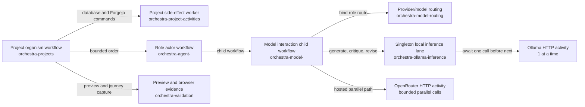

# Worker and model topology

Orchestra separates durable coordination, agent work, model reasoning, side effects, and scarce local inference into stable Temporal task queues. Queue names are part of workflow history, so they are defined in `packages/contracts/src/task-queues.ts` rather than assembled from process environment inside workflow code.



## Invariants

- Every role has a stable actor workflow ID and its own role queue. One process can poll all 14 queues for local development, while a production process can poll one role without changing workflow code or IDs.
- An agent never calls the model provider directly. It starts a bounded `modelInteractionWorkflow` on that role's model queue and resumes only after the child returns a reviewed draft.
- The model workflow owns a bounded generate, critique, and revise loop.
- A routing worker resolves `MODEL_PROVIDER_<ROLE>` (falling back to `MODEL_PROVIDER`) and the role model once. That provider/model pair is recorded in the brain workflow history and travels with every inference request.
- Ollama uses a dedicated queue and worker. One long-lived inference-lane workflow owns a FIFO mailbox and awaits each inference activity before scheduling the next; worker concurrency is unconditionally one.
- OpenRouter uses a separate queue and worker with bounded parallelism (default 8, maximum 64). Every generate, quality-review, and revision request appears as its own `openRouterInferenceWorkflow` child before invoking the provider Activity. Only this worker receives `OPENROUTER_API_KEY`; it requires explicit remote-data acknowledgement, caps output, reasoning, and response size, and retries bounded transient, malformed, or empty responses before failing the agent.
- Database, Forgejo, preview, and browser work stay on activity queues. Agent and model-brain workers do not need those credentials.
- Stable request IDs correlate lane responses and make duplicate requests reusable. An external model call cannot be mathematically exactly-once after an ambiguous network or process failure unless the provider gateway itself supports idempotency; Orchestra guarantees serialized active calls for local Ollama and durable orchestration around that boundary.

## Process modes

The delivery worker accepts `ORCHESTRA_WORKER_MODE=all|project|activities|agents`. `AGENT_WORKER_ROLES` accepts a comma-separated role list or the groups `all`, `iteration`, `release`, `shape`, `design`, `plan`, `build`, and `assure`.

The model worker accepts `MODEL_WORKER_MODE=all|brains|routing|ollama-inference|openrouter-inference|inference|compat`. `MODEL_WORKER_ROLES` uses the same selectors. Compose runs routing, Ollama inference, and OpenRouter inference as separate services. `inference` groups all three for host development; `all` also includes every brain and the compatibility bridge.

To give Builder a dedicated physical delivery worker and model-brain worker, stop polling Builder in the grouped processes and run:

```sh
ORCHESTRA_WORKER_MODE=agents AGENT_WORKER_ROLES=builder pnpm --filter @orchestra/worker dev
MODEL_WORKER_MODE=brains MODEL_WORKER_ROLES=builder pnpm --filter @orchestra/model-worker dev
```

Multiple processes may poll the same role or brain queue when load-balanced capacity is desired. For fixed ownership, ensure only the intended process polls that queue. Never point an agent worker at another role's queue merely to rename the process; the queue is the authority and scaling boundary.

## History compatibility

Existing project workflows keep the original `orchestra-projects` route. Queue changes inside workflow code are protected by Temporal patch markers. The project worker continues registering legacy activity handlers on the old queue while existing histories drain, and the model brain process keeps the legacy `orchestra-models` activity queue available. Persistent actors migrate to their role queue at a safe Continue-As-New boundary.

Removing either compatibility lane is an explicit migration after replay tests confirm that no running workflow still references it.
